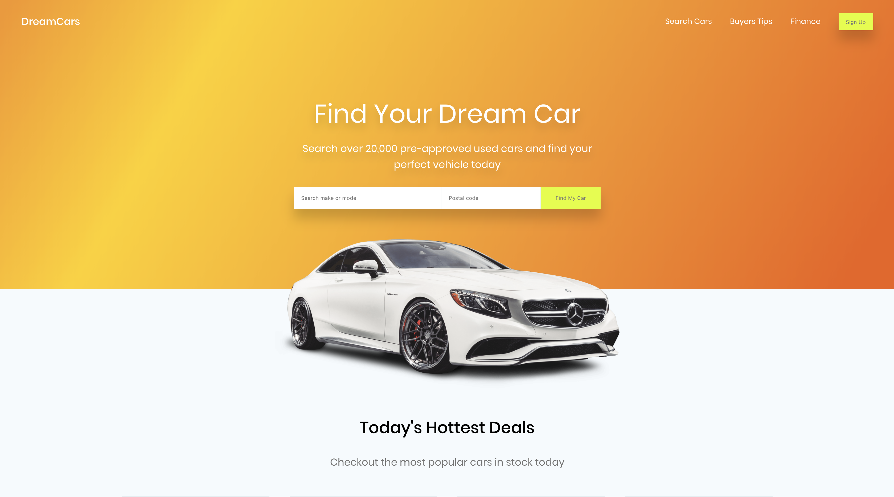

# DreamCars

## Links

- [Live UI](https://topleft.github.io/kata-car-ui/)
- [Sketch File](https://www.sketchappsources.com/free-source/3524-car-dealing-landing-page.html)

## UI Kata

This is part of my UI Kata learning initiative. I find sketch files of UI's on the internet and code them up focusing on 5 things:
 - React component structure
 - High quality CSS
 - Responsiveness (mobile first)
 - Component testing
 - Accessability

## Design

[Sam Fortune](http://samfortuneux.com/)

Thanks Sam, for great designs and a quality sketch file.

